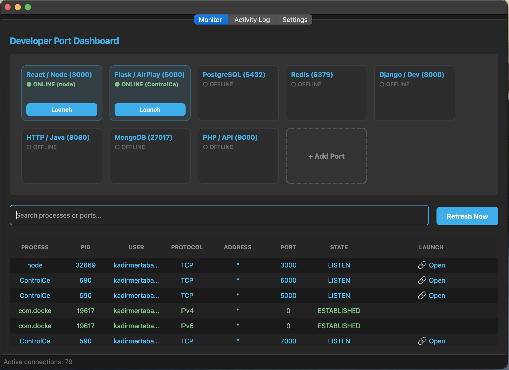
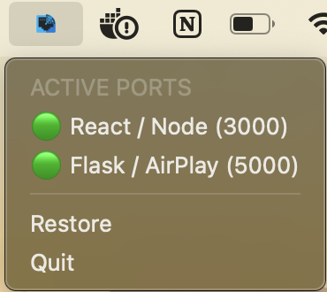

# Port Monitor

[](https://opensource.org/licenses/Apache-2.0)
[](https://www.qt.io/)
[](https://isocpp.org/)

**Port Monitor** is a powerful, professional desktop utility designed for developers and system administrators to visualize and manage active network ports in real-time. Built with **C++** and **Qt 6**, it combines high performance with a modern, glassmorphism-inspired interface.



---

## Key Features

### Smart Dashboard

- **Visual Cards**: View your most important ports (like 3000, 8080, 5432) as sleek, actionable cards.
- **Custom Tracking**: Add your own custom ports to the dashboard for quick monitoring.
- **Status Indicators**: Instantly see if a service is **Online (Green)** or **Offline (Gray)**.
- **Quick Actions**: Launch `localhost:<port>` in your browser directly from the card.

### Detailed Activity Log

- **Comprehensive Table**: View all active system ports in a sortable, filterable table.
- **Process Details**: See exact Process Names, PIDs, Users, and Protocols (TCP/UDP).
- **Advanced Filtering**: Search by process name, PID, or port to find exactly what you're looking for.
- **Context Actions**: Right-click any row to **Kill Process** or view more details.

### System Integration

- **System Tray**: The application continues running in the background even when closed. A discreet icon in your menu bar (as shown below) keeps you connected.
- **Quick Access**: Click the tray icon to instantly view a dropdown menu of all active ports and launch them.
- **Notifications**: Get native desktop notifications when a tracked service comes online.
- **Auto-Start**: Optionally launch Port Monitor automatically on system login.



### Modern Experience

- **Dark & Light Themes**: Fully supported dark mode with polished UI elements.
- **Responsive Design**: A fluid layout that adapts to your window size.

---

## Quick Start

### Prerequisites

- **Qt 6.2+** (Gui, Widgets, Network modules)
- **CMake 3.16+**
- **C++17 Compiler** (Clang/GCC)
- **macOS** or **Linux**

### Native Build (Recommended)

```bash
# Clone the repository
git clone <repository-url>
cd port-monitor

# Configure and Build
cmake -S . -B build -DCMAKE_BUILD_TYPE=Release
cmake --build build --config Release

# Launch Application
./build/PortMonitor
```

---

## Docker Deployment

For keeping your host system clean or testing in isolation:

```bash
# Build the image
docker build -t port-monitor .

# Run with helper script (macOS/Linux)
./run_docker.sh
```

> **Note:** On macOS, this script handles XQuartz setup for GUI display.

---

## Usage Guide

1. **Dashboard**: The main screen shows your "pinned" ports. Click **"Add Port"** to track a new specific port (e.g., your Rails server on 3000).
2. **Launching**: Click the launch icon on any card to open that service in your default web browser.
3. **Managing**: Click the Trash icon to stop tracking a custom port.
4. **Tray Menu**: Click the menu bar icon to see a dropdown of active ports. Clicking an item there also launches it in the browser.
5. **Settings**: Toggle themes, notifications, and auto-start preferences in the Settings tab.

---

## Project Architecture

```text
port-monitor/
├── src/
│   ├── main.cpp            // App entry & theme initialization
│   ├── MainWindow.cpp/h    // Controller & Main UI logic
│   ├── PortMonitor.cpp/h   // Backend scanner (lsof wrapper)
│   ├── PortTableModel.cpp  // Optimized QAbstractTableModel
│   └── ...
├── resources/
│   ├── images/             // UI assets and screenshots
│   ├── styles.qss          // CSS-like Qt stylesheets
│   └── resources.qrc       // Qt Resource Bundle
├── CMakeLists.txt          // Build configuration
└── Dockerfile              // Container definition
```

---

## License

Distributed under the **Apache License 2.0**. See `LICENSE` for more information.

Copyright © 2025 **Kadir Mert Abatay**. All rights reserved.
